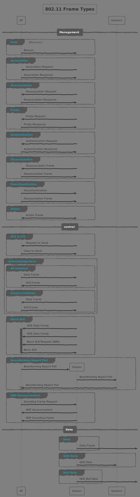

```text
#  _   _      _                      _    _
# | \ | | ___| |___      _____  _ __| | _(_)_ __   __ _
# |  \| |/ _ \ __\ \ /\ / / _ \| '__| |/ / | '_ \ / _` |
# | |\  |  __/ |_ \ V  V / (_) | |  |   <| | | | | (_| |
# |_| \_|\___|\__| \_/\_/ \___/|_|  |_|\_\_|_| |_|\__, |
#                                                 |___/
#
```

## Networking

Here is where the intro for networking will be.

### Wi-fi Networking Frames


