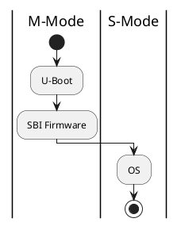
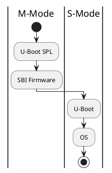

```text
  _   _       ____   ___   ___ _____
 | | | |     | __ ) / _ \ / _ \_   _|
 | | | |_____|  _ \| | | | | | || |
 | |_| |_____| |_) | |_| | |_| || |
  \___/      |____/ \___/ \___/ |_|
```

U-Boot: The Universal Bootloader
=================================

Primarily intended for SOCs and Risc-V processors, U-Boot is the new bootloader on the block, and represents the new future wave of smart bootloaders. 
If you are unfamiliar with it, and more accustomed to Grub, it can throw you for a loop. As U-Boot is way more
powerful and featureful than any of it's predecessors.

U-Boot Risc-V
-------------

Knowledge and understanding of U-Boot is currently most applicable to Risc-V systems. So having said such we
shall cover this apllicability.

### Two Sequences of booting with U-BOOT

There are two modes available for how to boot a Risc-V operating system using U-Boot.

1. M-Mode
2. S-Mode

#### M-Mode




#### S-Mode



