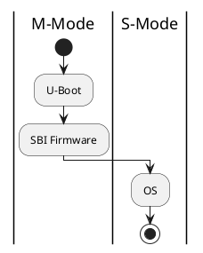
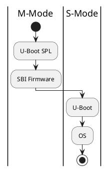

```text
  _   _       ____   ___   ___ _____
 | | | |     | __ ) / _ \ / _ \_   _|
 | | | |_____|  _ \| | | | | | || |
 | |_| |_____| |_) | |_| | |_| || |
  \___/      |____/ \___/ \___/ |_|
```

U-Boot: The Universal Bootloader
=================================

Primarily intended for SOCs and Risc-V processors, U-Boot is the new bootloader on the block, and represents the new future wave of smart bootloaders. 
If you are unfamiliar with it, and more accustomed to Grub, it can throw you for a loop. As U-Boot is way more
powerful and featureful than any of it's predecessors.

U-Boot Risc-V
-------------

Knowledge and understanding of U-Boot is currently most applicable to Risc-V systems. So having said such we
shall cover this apllicability.

### Two Sequences of booting with U-BOOT

There are two modes available for how to boot a Risc-V operating system using U-Boot.

1. M-Mode
2. S-Mode

#### M-Mode



``` puml
@startuml
|M-Mode|
start
: U-Boot ;
: SBI Firmware ;
| S-Mode |
: OS ;
stop
@enduml
```

#### S-Mode



```puml
@startuml
|M-Mode|
start
: U-Boot SPL ;
: SBI Firmware ;
|S-Mode|
: U-Boot ;
: OS ;
stop
@enduml
```

To discover the values for `kernel_addr_r`, `kernel_comp_addr_r`, `kernel_comp_size`, `fdt_addr_r`, and `ramdisk_addr_r` needed for U-Boot configuration in a `uEnv.txt` file (or similar boot scripts), you need to consider the specific hardware platform (e.g., ARM or RISC-V board like BeagleBone, Jetson TX2, or VisionFive 2), as these are RAM load addresses tailored to the device's memory layout, RAM size, and bootloader requirements. These variables define where U-Boot loads the kernel image, compressed kernel (if applicable), device tree blob (DTB/FDT), and initramfs/ramdisk into memory during the boot process. They must avoid overlapping with each other, reserved memory regions, or U-Boot itself to prevent crashes or corruption.

Here's a step-by-step process to determine these values:

### 1. **Understand the Role of Each Variable**
   - **`kernel_addr_r`**: The RAM address where the uncompressed kernel image (e.g., `zImage` or `Image`) is loaded. Often starts near the base of usable RAM (e.g., 0x80000000 on many ARM systems or 0x40200000 on some RISC-V boards).
   - **`kernel_comp_addr_r`**: The RAM address for loading a compressed kernel (e.g., for `booti` or `bootz` commands). Used as a temporary buffer for decompression; should be in a free area of RAM (e.g., 0x90000000 or higher).
   - **`kernel_comp_size`**: The maximum size allocated for the compressed kernel buffer. This must be at least as large as your compressed kernel file (e.g., 0x4000000 or 64MB; check your kernel file size with `ls -l` or `du`).
   - **`fdt_addr_r`**: The RAM address for the flattened device tree (DTB/FDT) file, which describes hardware to the kernel. Typically placed after the kernel to avoid overlap (e.g., 0x82000000 or 0x46000000).
   - **`ramdisk_addr_r`**: The RAM address for the initramfs or ramdisk image (e.g., `initrd.img`). Placed after the FDT (e.g., 0x82800000 or 0x48100000). Use '-' in boot commands if no ramdisk is needed.

   These are U-Boot environment variables, often set in `uEnv.txt` (a plain-text file on the boot partition) or via `setenv` commands in the U-Boot console.

### 2. **Check Board-Specific Documentation and Examples**
   - Review the manufacturer's documentation for your board (e.g., BeagleBoard, NVIDIA Jetson, or StarFive VisionFive docs). These often provide default values or memory maps.
     - Example for VisionFive 2 (RISC-V) from board firmware configs:
       - `kernel_addr_r=0x40200000`
       - `kernel_comp_addr_r=0x90000000`
       - `kernel_comp_size=0x4000000` (64MB)
       - `fdt_addr_r=0x46000000`
       - `ramdisk_addr_r=0x48100000`
     - Example for NVIDIA Jetson TX2 (ARM):
       - `kernel_addr_r=0x80080000`
       - `fdt_addr_r=0x82000000`
       - `ramdisk_addr_r=0x82800000` (may need adjustment to 0x92800000 for larger kernels to avoid overlap)
     - Example for generic ARM systems (e.g., from U-Boot docs):
       - `kernel_addr_r=0x80000000`
       - `fdt_addr_r=0x80F80000`
       - `ramdisk_addr_r=0x02100000`
   - Search for your board's U-Boot defconfig file in the U-Boot source code (e.g., on GitHub at u-boot/u-boot). Look for macros like `CONFIG_SYS_LOAD_ADDR` or `CONFIG_EXTRA_ENV_SETTINGS`, which often define defaults.
   - Kernel documentation (e.g., Documentation/arm/booting.rst in Linux source) recommends FDT placement within the first 128MB of RAM to avoid issues.

### 3. **Access the U-Boot Console to Inspect Defaults**
   - Connect to your board via serial console (e.g., using minicom or screen at 115200 baud).
   - Interrupt the boot process (usually by pressing any key during countdown) to enter the U-Boot prompt (e.g., `=>`).
   - Run `printenv` to list all environment variables. Look for the ones you need—if they're not explicitly set, U-Boot may use internal defaults like `CONFIG_SYS_LOAD_ADDR` (compile-time constant; check with `bdinfo` or `md` commands for memory info).
   - Test loading files manually:
     - `fatload mmc 0:1 ${kernel_addr_r} /path/to/Image` (adjust for your storage and filesystem).
     - If it fails (e.g., "bad address"), try a different value and note overlaps.
   - Use `bdinfo` or `mmap` (if available) to view the board's memory map and identify free RAM regions.
   - For compressed kernels, test with `booti` or `bootz` commands to verify decompression works without overlap.

### 4. **Calculate Values Based on Memory Layout**
   - Determine your board's total RAM (e.g., via datasheet or `bdinfo` in U-Boot).
   - Allocate addresses starting from the base of DRAM (e.g., 0x80000000 on 32-bit ARM), leaving space for U-Boot (usually at the top or bottom).
   - Rough calculation guidelines:
     - `kernel_addr_r`: Base RAM + offset (e.g., 0x80000000; must align with kernel requirements, often 2MB-aligned).
     - `kernel_comp_addr_r`: After expected uncompressed kernel size (e.g., kernel_addr_r + 0x10000000 for a 256MB buffer).
     - `kernel_comp_size`: At least the size of your compressed kernel (use `ls -l Image.gz` to measure) + margin (e.g., 1.5x the file size).
     - `fdt_addr_r`: After kernel (e.g., kernel_addr_r + expected kernel size; DTBs are small, ~100KB, so add 0x1000000 or 16MB buffer).
     - `ramdisk_addr_r`: After FDT (e.g., fdt_addr_r + 0x100000; measure your initrd size and add buffer to avoid overwrite).
   - Set high-water marks like `fdt_high=0xffffffffffffffff` or `initrd_high=0xffffffffffffffff` in U-Boot env to prevent relocation.
   - Test for overlaps: Load all components and boot; if it fails (e.g., "Bad FIT image" or corruption), increase spacing.

### 5. **Apply to uEnv.txt and Test**
   - Mount the boot partition (e.g., FAT-formatted MMC/SD card) on a host machine.
   - Create or edit `uEnv.txt` with lines like:
     ```
     kernel_addr_r=0x80000000
     kernel_comp_addr_r=0x90000000
     kernel_comp_size=0x4000000
     fdt_addr_r=0x82000000
     ramdisk_addr_r=0x82800000
     ```
   - Add boot commands, e.g., `uenvcmd=load mmc 0:1 ${kernel_addr_r} /boot/Image; load mmc 0:1 ${fdt_addr_r} /boot/system.dtb; booti ${kernel_addr_r} - ${fdt_addr_r}`.
   - Boot and monitor for errors via serial console. Iterate by adjusting values and saving env with `saveenv` in U-Boot.
   - If using distros like Debian or Fedora on RISC-V boards, check their boot scripts for presets.

If these values aren't documented for your board, start with examples from similar hardware and test iteratively. Always back up your boot media, as incorrect addresses can brick the boot process (recoverable via serial or JTAG). For more precise values, provide your board model for tailored advice.

In U-Boot, listing partitions depends on the storage interface (e.g., MMC for SD/eMMC, USB, SCSI for SATA/IDE). You'll typically need to enter the U-Boot console by interrupting the boot process via a serial connection (e.g., pressing any key during the countdown).

### General Steps
1. **Identify Available Devices**:
   - For MMC (common for embedded boards): Run `mmc list` to show detected MMC devices (e.g., SD card as 0, eMMC as 1).
   - For USB: Run `usb start` (or `usb reset`) to initialize USB storage, then `usb dev` to list devices.
   - For SCSI/SATA: Run `scsi scan` (or `scsi reset`), then `scsi dev` or `scsi info` to list devices.
   - For IDE: Run `ide reset`, then `ide info` to list devices.

2. **Select a Device (if needed)**:
   - For MMC: Use `mmc dev <devnum> [<hwpart>]` to switch to a specific device and optional hardware partition (e.g., `mmc dev 0` for SD card main area, `mmc dev 0 1` for eMMC boot partition 1).

3. **List Partitions**:
   - The primary command is `part list <interface> <devnum>[.<hwpart>]` (e.g., `part list mmc 0` for MMC device 0 main area, or `part list mmc 0.1` for hardware boot partition 1).
   - For MMC specifically, you can also use the shorthand `mmc part` after selecting the device with `mmc dev`—this lists partitions on the current MMC device (e.g., GUID or DOS/MBR type, with start sectors and sizes).
   - Examples for other interfaces:
     - USB: `part list usb 0`
     - SCSI: `part list scsi 0`
     - IDE: `part list ide 0`

If no partitions are shown, the disk might lack a partition table (e.g., raw formatted), or the device/interface isn't properly initialized. Use `help part` or `help mmc` in U-Boot for more details on these commands. Specifics can vary by U-Boot version and board configuration—check your board's documentation for any customizations.
